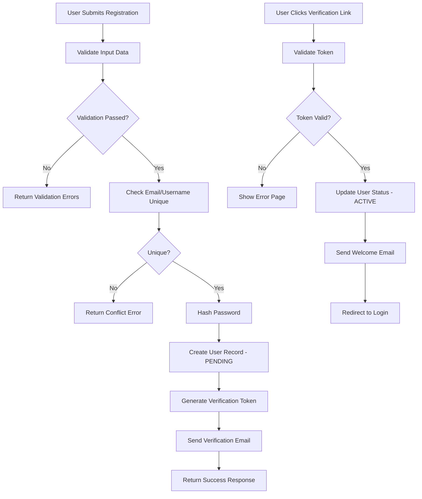

# User Lifecycle Management

This guide covers the complete user lifecycle in the IvyArc system, from initial registration through account deactivation, including all administrative operations.

## 📋 User Lifecycle Overview

```
┌─────────────┐    ┌──────────────┐    ┌─────────────┐    ┌──────────────┐
│  Pending    │───▶│   Active     │───▶│  Suspended  │───▶│  Deactivated │
│ (Unverified)│    │ (Verified)   │    │ (Temporary) │    │ (Permanent)  │
└─────────────┘    └──────────────┘    └─────────────┘    └──────────────┘
       │                   │                   │                   │
       ▼                   ▼                   ▼                   ▼
┌─────────────┐    ┌──────────────┐    ┌─────────────┐    ┌──────────────┐
│ - No access │    │ - Full access│    │ - No login  │    │ - No access  │
│ - Can verify│    │ - All features│    │ - Data kept │    │ - Data purged│
│ - 24h expiry│    │ - Role-based │    │ - Can restore│   │ - Irreversible│
└─────────────┘    └──────────────┘    └─────────────┘    └──────────────┘
```

## 🔄 User States

### 1. Pending (Unverified)
**Description**: Newly registered users who haven't verified their email address.

**Characteristics**:
- Account exists in the system
- Cannot login to the application
- Can only access email verification endpoints
- Account automatically deleted after 24 hours if not verified
- Can resend verification email

**Admin Actions**:
- Manually verify user
- Resend verification email
- Delete unverified account
- View registration details

### 2. Active (Verified)
**Description**: Fully verified users with complete system access based on their roles.

**Characteristics**:
- Full system access according to assigned roles
- Can login and use all features
- Can modify their profile
- Subject to all security policies
- Activity is logged and audited

**Admin Actions**:
- Modify user profile
- Change user roles and permissions
- View user activity logs
- Reset user password
- Suspend or deactivate account

### 3. Suspended (Temporary Restriction)
**Description**: Users temporarily restricted from accessing the system.

**Characteristics**:
- Cannot login to the system
- All active sessions are terminated
- Account data is preserved
- Can be restored to active status
- User receives suspension notification

**Common Reasons**:
- Multiple failed login attempts
- Security policy violations
- Administrative investigation
- Suspicious activity detected

**Admin Actions**:
- Restore to active status
- Extend suspension period
- Convert to permanent deactivation
- Review suspension reason

### 4. Deactivated (Permanent)
**Description**: Permanently disabled accounts that cannot be restored.

**Characteristics**:
- Permanently cannot login
- All sessions terminated
- Personal data may be purged (GDPR compliance)
- Username/email may be released for reuse
- Action is irreversible

**Common Reasons**:
- User requested account deletion
- Terms of service violation
- Data retention policy compliance
- Security breach containment

## 👥 User Registration Process

### Standard Registration Flow



### Admin-Initiated Registration

Administrators can create users directly:

1. **Access User Management**
   - Navigate to Admin Dashboard → User Management
   - Click "Create New User"

2. **Fill User Information**
   ```json
   {
     "username": "newuser",
     "email": "user@company.com",
     "firstName": "John",
     "lastName": "Doe",
     "temporaryPassword": "TempPass123!",
     "roles": ["USER"],
     "skipEmailVerification": true,
     "sendWelcomeEmail": true
   }
   ```

3. **User Onboarding**
   - User receives welcome email with temporary password
   - First login forces password change
   - Account immediately active (skips verification)

## 🔧 User Management Operations

### Profile Management

#### Update User Profile
```bash
PUT /api/v1/admin/users/{userId}
Authorization: Bearer {admin-token}

{
  "firstName": "Updated Name",
  "lastName": "Updated Surname",
  "email": "newemail@company.com",
  "phoneNumber": "+1234567890"
}
```

**Admin Considerations**:
- Email changes trigger verification process
- Profile history is maintained for audit
- Changes are logged in audit system
- User receives notification of changes

#### Password Management
```bash
# Reset user password (forces change on next login)
POST /api/v1/admin/users/{userId}/reset-password
{
  "temporaryPassword": "TempPassword123!",
  "forceChangeOnLogin": true,
  "notifyUser": true
}

# Expire current password immediately
POST /api/v1/admin/users/{userId}/expire-password
```

### Role and Permission Management

#### Assign Roles
```bash
POST /api/v1/admin/users/{userId}/roles
{
  "roleIds": ["role-uuid-1", "role-uuid-2"],
  "assignedBy": "admin-user-id",
  "reason": "Department transfer"
}
```

#### Remove Roles
```bash
DELETE /api/v1/admin/users/{userId}/roles/{roleId}
{
  "reason": "Role no longer required"
}
```

**Best Practices**:
- Always provide reason for role changes
- Use principle of least privilege
- Review role assignments regularly
- Document role assignment rationale

### Account Status Management

#### Suspend User Account
```bash
POST /api/v1/admin/users/{userId}/suspend
{
  "reason": "Security investigation",
  "suspensionDuration": "PT72H",  // ISO 8601 duration
  "notifyUser": true,
  "terminateActiveSessions": true
}
```

#### Reactivate Suspended Account
```bash
POST /api/v1/admin/users/{userId}/reactivate
{
  "reason": "Investigation completed - no issues found",
  "notifyUser": true
}
```

#### Deactivate Account (Permanent)
```bash
POST /api/v1/admin/users/{userId}/deactivate
{
  "reason": "User requested account deletion",
  "purgeData": true,
  "retentionPeriod": "P30D"  // Keep for 30 days before purge
}
```

## 📊 User Analytics and Monitoring

### User Activity Tracking

Monitor user behavior and engagement:

```sql
-- Active users in the last 30 days
SELECT 
    COUNT(DISTINCT user_id) as active_users,
    DATE_TRUNC('day', last_login) as login_date
FROM users 
WHERE last_login >= NOW() - INTERVAL '30 days'
GROUP BY login_date
ORDER BY login_date;

-- User session analytics
SELECT 
    u.username,
    COUNT(s.id) as total_sessions,
    AVG(EXTRACT(EPOCH FROM (s.last_accessed - s.created_at))/60) as avg_session_minutes,
    MAX(s.last_accessed) as last_activity
FROM users u
LEFT JOIN user_sessions s ON u.id = s.user_id
WHERE u.is_active = true
GROUP BY u.id, u.username;
```

### Security Monitoring

Track security-related events:

```sql
-- Failed login attempts by user
SELECT 
    u.username,
    COUNT(*) as failed_attempts,
    MAX(se.timestamp) as last_attempt,
    array_agg(DISTINCT se.ip_address) as ip_addresses
FROM security_events se
JOIN users u ON u.id = se.user_id
WHERE se.event_type = 'LOGIN_FAILED'
    AND se.timestamp >= NOW() - INTERVAL '24 hours'
GROUP BY u.id, u.username
HAVING COUNT(*) >= 3;

-- Suspicious login locations
SELECT 
    u.username,
    se.ip_address,
    se.metadata->>'location' as location,
    COUNT(*) as login_count
FROM security_events se
JOIN users u ON u.id = se.user_id
WHERE se.event_type = 'LOGIN_SUCCESS'
    AND se.timestamp >= NOW() - INTERVAL '7 days'
GROUP BY u.username, se.ip_address, se.metadata->>'location';
```

## 🚨 Security Incident Response

### Account Compromise Response

When a user account is potentially compromised:

1. **Immediate Actions**
   ```bash
   # Suspend account immediately
   POST /api/v1/admin/users/{userId}/suspend
   {
     "reason": "Potential account compromise",
     "terminateActiveSessions": true,
     "notifyUser": false
   }
   
   # Invalidate all tokens
   POST /api/v1/admin/users/{userId}/invalidate-tokens
   ```

2. **Investigation**
   - Review recent login activity
   - Check access patterns for anomalies
   - Analyze audit logs for suspicious actions
   - Coordinate with security team

3. **Recovery Process**
   - Force password reset
   - Verify user identity through out-of-band communication
   - Review and potentially revoke permissions
   - Monitor account after reactivation

### Mass Security Response

For system-wide security incidents:

```bash
# Suspend multiple users
POST /api/v1/admin/users/bulk-suspend
{
  "userIds": ["user1", "user2", "user3"],
  "reason": "System security incident",
  "terminateActiveSessions": true
}

# Force password reset for all users
POST /api/v1/admin/users/bulk-password-reset
{
  "userFilter": {
    "lastLogin": {"before": "2024-01-01T00:00:00Z"},
    "roles": ["USER"]
  },
  "reason": "Security policy compliance"
}
```

## 📋 Compliance and Data Management

### GDPR Compliance

#### Data Export (Subject Access Request)
```bash
GET /api/v1/admin/users/{userId}/data-export
Authorization: Bearer {admin-token}

# Returns comprehensive user data package
{
  "userProfile": {...},
  "activityLogs": [...],
  "sessionHistory": [...],
  "auditEvents": [...],
  "exportTimestamp": "2024-01-15T10:30:00Z"
}
```

#### Data Purge (Right to be Forgotten)
```bash
POST /api/v1/admin/users/{userId}/purge-data
{
  "reason": "GDPR right to be forgotten request",
  "retainMinimal": true,  // Keep minimal data for legal/audit purposes
  "anonymizeInLogs": true // Replace identifiable data with anonymous IDs
}
```

### Data Retention Policies

Automated data retention management:

```yaml
# Data retention configuration
data-retention:
  inactive-users:
    threshold: "P2Y"  # 2 years inactive
    action: "DEACTIVATE"
    
  audit-logs:
    retention: "P7Y"  # 7 years for compliance
    
  session-data:
    retention: "P90D"  # 90 days
    
  security-events:
    retention: "P5Y"   # 5 years for security analysis
```

## 📈 User Lifecycle Metrics

### Key Performance Indicators

Track important user lifecycle metrics:

```sql
-- User registration conversion rate
WITH registrations AS (
  SELECT 
    DATE_TRUNC('week', created_at) as week,
    COUNT(*) as total_registrations,
    COUNT(*) FILTER (WHERE is_verified = true) as verified_users
  FROM users
  WHERE created_at >= NOW() - INTERVAL '12 weeks'
  GROUP BY week
)
SELECT 
  week,
  total_registrations,
  verified_users,
  ROUND(verified_users::numeric / total_registrations * 100, 2) as conversion_rate
FROM registrations
ORDER BY week;

-- User engagement metrics
SELECT 
  DATE_TRUNC('month', created_at) as cohort_month,
  COUNT(*) as total_users,
  COUNT(*) FILTER (WHERE last_login >= NOW() - INTERVAL '30 days') as active_users,
  COUNT(*) FILTER (WHERE last_login >= NOW() - INTERVAL '7 days') as weekly_active
FROM users
WHERE is_active = true
GROUP BY cohort_month
ORDER BY cohort_month;
```

### Automated Reporting

Set up automated reports for user lifecycle monitoring:

1. **Daily Active Users (DAU)**
2. **Weekly Registration Reports**
3. **Security Incident Summary**
4. **Account Status Distribution**
5. **Role Assignment Changes**

---

**Related Documentation**:
- [Role and Permission Management](./roles-and-permissions.md)
- [Security Monitoring](../system-admin/security-monitoring.md)
- [Audit Log Management](../audit/audit-log-analysis.md)

**Navigation**: [← Admin Guides](../README.md) | [User Roles](./roles-and-permissions.md) | [System Admin](../system-admin/)