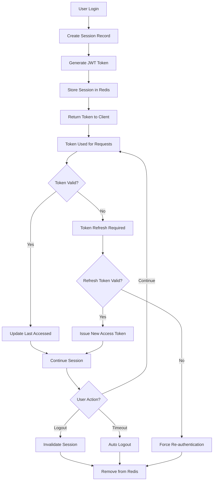

# Security Model

The IvyArc authentication system implements a comprehensive security model based on industry best practices, including defense in depth, zero trust principles, and comprehensive audit logging.

## 🏗️ Security Architecture

### Multi-Layer Security Approach

```
┌─────────────────────────────────────────────────────────────┐
│                    External Security                        │
│  • TLS 1.3 Encryption    • DDoS Protection                │
│  • WAF (Web App Firewall) • Geographic IP Filtering       │
└─────────────────┬───────────────────────────────────────────┘
                  │
┌─────────────────▼───────────────────────────────────────────┐
│                   API Gateway Security                     │
│  • JWT Validation        • Rate Limiting                   │
│  • CORS Enforcement      • Request Size Limits             │
│  • Security Headers      • Input Sanitization             │
└─────────────────┬───────────────────────────────────────────┘
                  │
┌─────────────────▼───────────────────────────────────────────┐
│               Application Security                          │
│  • RBAC Authorization    • Password Policies               │
│  • Session Management    • MFA (Planned)                   │
│  • Audit Logging        • Data Validation                 │
└─────────────────┬───────────────────────────────────────────┘
                  │
┌─────────────────▼───────────────────────────────────────────┐
│                 Data Security                               │
│  • Database Encryption   • Connection Pooling              │
│  • Password Hashing      • Secrets Management              │
│  • Data Classification   • Backup Encryption              │
└─────────────────────────────────────────────────────────────┘
```

## 🔐 Authentication Architecture

### JWT Token-Based Authentication

#### Token Structure
```json
{
  "header": {
    "alg": "RS256",
    "typ": "JWT",
    "kid": "key-id-2024-01"
  },
  "payload": {
    "sub": "550e8400-e29b-41d4-a716-446655440000",
    "iss": "ivyarc-auth-service",
    "aud": ["api-gateway", "user-service", "admin-portal"],
    "exp": 1640995200,
    "iat": 1640991600,
    "jti": "unique-token-id",
    "authorities": ["ROLE_USER"],
    "permissions": ["user:read", "user:update-self"],
    "session_id": "session-uuid",
    "username": "johndoe",
    "email": "john@example.com",
    "ip_address": "192.168.1.100",
    "device_id": "device-fingerprint-hash"
  }
}
```

#### Token Security Features

**RSA-256 Signing**
- Private key for signing (Auth Service only)
- Public key for verification (distributed to services)
- Key rotation every 90 days
- Multiple active keys for smooth transitions

**Token Validation**
- Signature verification
- Expiration time checking
- Issuer validation
- Audience verification
- Not-before time validation

**Security Claims**
- IP address binding for suspicious location detection
- Device fingerprinting for session tracking
- Session ID for targeted logout
- Comprehensive user context

### Session Management

#### Session Lifecycle


#### Session Security Controls

**Session Limits**
- Maximum 10 concurrent sessions per user
- Automatic cleanup of oldest sessions when limit exceeded
- Session timeout after 30 minutes of inactivity
- Absolute session lifetime of 24 hours

**Session Tracking**
```sql
CREATE TABLE user_sessions (
    id UUID PRIMARY KEY DEFAULT gen_random_uuid(),
    user_id UUID REFERENCES users(id) ON DELETE CASCADE,
    session_token VARCHAR(255) UNIQUE NOT NULL,
    refresh_token VARCHAR(255) UNIQUE,
    expires_at TIMESTAMP NOT NULL,
    created_at TIMESTAMP DEFAULT CURRENT_TIMESTAMP,
    last_accessed TIMESTAMP DEFAULT CURRENT_TIMESTAMP,
    ip_address INET,
    user_agent TEXT,
    device_fingerprint VARCHAR(255),
    is_active BOOLEAN DEFAULT true
);
```

## 🛡️ Authorization Model (RBAC)

### Role-Based Access Control

#### Permission System
```
Resource:Action format
Examples:
- user:read          (Read user information)
- user:write         (Create/update users)
- user:delete        (Delete users)
- admin:system       (System administration)
- audit:read         (View audit logs)
- role:assign        (Assign roles to users)
```

#### Role Hierarchy
```
SUPER_ADMIN (All permissions)
    │
    ├─ ADMIN (User and system management)
    │   │
    │   ├─ USER_MANAGER (User operations only)
    │   └─ AUDIT_MANAGER (Audit log access)
    │
    └─ USER (Basic user permissions)
        │
        └─ GUEST (Read-only public access)
```

#### Permission Matrix
```sql
-- Core permissions table
CREATE TABLE permissions (
    id UUID PRIMARY KEY DEFAULT gen_random_uuid(),
    name VARCHAR(100) UNIQUE NOT NULL,
    resource VARCHAR(100) NOT NULL,
    action VARCHAR(50) NOT NULL,
    description TEXT,
    created_at TIMESTAMP DEFAULT CURRENT_TIMESTAMP
);

-- Example permissions
INSERT INTO permissions (name, resource, action, description) VALUES
('user:read', 'user', 'read', 'View user information'),
('user:write', 'user', 'write', 'Create and update users'),
('user:delete', 'user', 'delete', 'Delete users'),
('admin:system', 'admin', 'system', 'System administration'),
('audit:read', 'audit', 'read', 'View audit logs');
```

### Dynamic Authorization

#### API Endpoint Protection
```java
@PreAuthorize("hasPermission('user', 'read')")
@GetMapping("/api/v1/users/{id}")
public ResponseEntity<User> getUser(@PathVariable UUID id) {
    // Implementation
}

@PreAuthorize("hasPermission('user', 'write') and #userId == authentication.principal.id")
@PutMapping("/api/v1/users/{userId}")
public ResponseEntity<User> updateUser(@PathVariable UUID userId, @RequestBody User user) {
    // Users can only update their own profile unless they have user:write permission
}
```

#### Resource-Based Authorization
```sql
-- API resources for fine-grained control
CREATE TABLE api_resources (
    id UUID PRIMARY KEY DEFAULT gen_random_uuid(),
    service_name VARCHAR(50) NOT NULL,
    endpoint_pattern VARCHAR(255) NOT NULL,
    http_method VARCHAR(10) NOT NULL,
    required_permission VARCHAR(100) NOT NULL,
    is_public BOOLEAN DEFAULT false,
    created_at TIMESTAMP DEFAULT CURRENT_TIMESTAMP
);

-- Example API resource definitions
INSERT INTO api_resources (service_name, endpoint_pattern, http_method, required_permission, is_public) VALUES
('user-service', '/api/v1/users', 'GET', 'user:read', false),
('user-service', '/api/v1/users/{id}', 'PUT', 'user:write', false),
('user-service', '/api/v1/users/{id}', 'DELETE', 'user:delete', false),
('auth-service', '/api/v1/auth/login', 'POST', '', true);
```

## 🔒 Password Security

### Password Policy

#### Requirements
- **Minimum Length**: 8 characters
- **Character Complexity**:
  - At least 1 uppercase letter (A-Z)
  - At least 1 lowercase letter (a-z)  
  - At least 1 digit (0-9)
  - At least 1 special character (!@#$%^&*()_+-=[]{}|;:,.<>?)
- **History**: Cannot reuse last 5 passwords
- **Expiration**: 90 days (configurable)
- **Breach Check**: Integration with HaveIBeenPwned API

#### Password Storage
```java
@Component
public class PasswordEncoder {
    
    // BCrypt with cost factor 12 (4096 rounds)
    private static final int BCRYPT_STRENGTH = 12;
    
    public String encode(String rawPassword) {
        return BCrypt.hashpw(rawPassword, BCrypt.gensalt(BCRYPT_STRENGTH));
    }
    
    public boolean matches(String rawPassword, String encodedPassword) {
        return BCrypt.checkpw(rawPassword, encodedPassword);
    }
}
```

#### Password Reset Security
- **Token Generation**: Cryptographically secure random tokens (32 bytes)
- **Token Expiration**: 1 hour maximum lifetime
- **Single Use**: Tokens invalidated after successful reset
- **Rate Limiting**: Maximum 3 reset requests per hour per email
- **Email Verification**: Both old and new email notified of changes

## 🔍 Security Monitoring

### Real-Time Threat Detection

#### Suspicious Activity Patterns
```sql
-- Failed login attempt monitoring
SELECT 
    user_id,
    ip_address,
    COUNT(*) as failed_attempts,
    MAX(timestamp) as last_attempt
FROM security_events 
WHERE event_type = 'LOGIN_FAILED' 
    AND timestamp >= NOW() - INTERVAL '1 hour'
GROUP BY user_id, ip_address
HAVING COUNT(*) >= 5;

-- Unusual login locations
SELECT 
    se.user_id,
    u.username,
    se.ip_address,
    se.metadata->>'location' as new_location,
    se.timestamp
FROM security_events se
JOIN users u ON u.id = se.user_id
WHERE se.event_type = 'LOGIN_SUCCESS'
    AND se.ip_address NOT IN (
        SELECT DISTINCT ip_address 
        FROM security_events 
        WHERE user_id = se.user_id 
            AND timestamp >= NOW() - INTERVAL '30 days'
            AND timestamp < se.timestamp
    );
```

#### Automated Response Actions
- **Account Lockout**: After 5 consecutive failed login attempts
- **IP Rate Limiting**: Temporary IP blocks for excessive requests
- **Session Termination**: Kill suspicious sessions automatically
- **Admin Alerts**: Real-time notifications for high-risk events

### Audit Trail

#### Comprehensive Event Logging
```sql
CREATE TABLE audit_logs (
    id UUID PRIMARY KEY DEFAULT gen_random_uuid(),
    user_id UUID,
    session_id UUID,
    action VARCHAR(100) NOT NULL,
    resource VARCHAR(100),
    resource_id VARCHAR(100),
    service_name VARCHAR(50),
    endpoint VARCHAR(255),
    http_method VARCHAR(10),
    request_ip INET,
    user_agent TEXT,
    request_payload JSONB,
    response_status INTEGER,
    response_payload JSONB,
    execution_time_ms INTEGER,
    timestamp TIMESTAMP DEFAULT CURRENT_TIMESTAMP,
    
    -- Indexes for query performance
    INDEX idx_audit_logs_user_id (user_id),
    INDEX idx_audit_logs_timestamp (timestamp),
    INDEX idx_audit_logs_action (action),
    INDEX idx_audit_logs_resource (resource)
);
```

#### Security Event Categories
- **Authentication Events**: Login, logout, failed attempts
- **Authorization Events**: Permission checks, role assignments
- **Data Access Events**: Read, create, update, delete operations
- **Administrative Events**: User management, system changes
- **Security Events**: Suspicious activities, policy violations

## 🌐 Network Security

### Transport Layer Security

#### TLS Configuration
```yaml
# nginx SSL configuration
ssl_protocols TLSv1.3 TLSv1.2;
ssl_ciphers ECDHE-ECDSA-AES128-GCM-SHA256:ECDHE-RSA-AES128-GCM-SHA256:ECDHE-ECDSA-AES256-GCM-SHA384:ECDHE-RSA-AES256-GCM-SHA384;
ssl_prefer_server_ciphers off;
ssl_session_cache shared:SSL:10m;
ssl_session_timeout 10m;

# Security headers
add_header Strict-Transport-Security "max-age=31536000; includeSubDomains; preload" always;
add_header X-Frame-Options "SAMEORIGIN" always;
add_header X-Content-Type-Options "nosniff" always;
add_header Referrer-Policy "strict-origin-when-cross-origin" always;
add_header Content-Security-Policy "default-src 'self'" always;
```

#### CORS Configuration
```java
@Configuration
@EnableWebSecurity
public class CorsConfiguration {
    
    @Bean
    public CorsConfigurationSource corsConfigurationSource() {
        CorsConfiguration configuration = new CorsConfiguration();
        configuration.setAllowedOriginPatterns(Arrays.asList(
            "https://*.ivyarc.pro",
            "https://localhost:*"
        ));
        configuration.setAllowedMethods(Arrays.asList("GET", "POST", "PUT", "DELETE", "OPTIONS"));
        configuration.setAllowedHeaders(Arrays.asList("*"));
        configuration.setAllowCredentials(true);
        configuration.setMaxAge(3600L);
        
        UrlBasedCorsConfigurationSource source = new UrlBasedCorsConfigurationSource();
        source.registerCorsConfiguration("/**", configuration);
        return source;
    }
}
```

### API Security

#### Rate Limiting Strategy
```yaml
rate-limiting:
  global:
    requests-per-minute: 1000
    burst-size: 100
    
  per-endpoint:
    "/api/v1/auth/login":
      requests-per-minute: 5
      burst-size: 2
      
    "/api/v1/auth/register":
      requests-per-minute: 3
      burst-size: 1
      
    "/api/v1/auth/forgot-password":
      requests-per-minute: 3
      burst-size: 1
```

#### Input Validation & Sanitization
```java
@Component
public class InputValidator {
    
    private static final Pattern SQL_INJECTION_PATTERN = 
        Pattern.compile("('|(\\-\\-)|(;)|(\\|)|(\\*)|(%))", Pattern.CASE_INSENSITIVE);
    
    private static final Pattern XSS_PATTERN = 
        Pattern.compile("(<script>|</script>|<iframe>|</iframe>|javascript:|vbscript:)", Pattern.CASE_INSENSITIVE);
    
    public boolean containsMaliciousContent(String input) {
        if (input == null) return false;
        
        return SQL_INJECTION_PATTERN.matcher(input).find() || 
               XSS_PATTERN.matcher(input).find();
    }
    
    public String sanitizeInput(String input) {
        if (input == null) return null;
        
        return input.replaceAll("[<>\"'%;()&+]", "");
    }
}
```

## 🔧 Security Configuration

### Environment-Specific Settings

#### Development Environment
```yaml
security:
  jwt:
    secret: "dev-secret-key-minimum-64-characters-for-security"
    access-token-expiry: 3600  # 1 hour
    refresh-token-expiry: 86400  # 24 hours
    
  password-policy:
    min-length: 6  # Relaxed for development
    require-special-chars: false
    
  rate-limiting:
    enabled: false
    
  audit:
    level: DEBUG
```

#### Production Environment
```yaml
security:
  jwt:
    secret: "${JWT_SECRET_KEY}"  # From environment/secrets
    access-token-expiry: 900    # 15 minutes
    refresh-token-expiry: 2592000  # 30 days
    
  password-policy:
    min-length: 12
    require-special-chars: true
    breach-check: true
    
  rate-limiting:
    enabled: true
    strict-mode: true
    
  audit:
    level: INFO
    retention-days: 2555  # 7 years for compliance
```

### Secrets Management

#### Secret Rotation Strategy
```yaml
# Automated secret rotation schedule
secrets:
  jwt-keys:
    rotation-interval: "P90D"  # Every 90 days
    overlap-period: "P7D"      # 7 days overlap for smooth transition
    
  database-passwords:
    rotation-interval: "P180D"  # Every 6 months
    
  api-keys:
    rotation-interval: "P30D"   # Monthly rotation
```

## 📋 Security Compliance

### GDPR Compliance

#### Data Protection Measures
- **Data Minimization**: Only collect necessary user data
- **Purpose Limitation**: Use data only for stated purposes
- **Storage Limitation**: Automatic data purging after retention period
- **Data Portability**: Export user data in structured format
- **Right to be Forgotten**: Complete data deletion on request

#### Privacy Controls
```java
@Service
public class PrivacyService {
    
    // Export all user data (GDPR Article 20)
    public UserDataExport exportUserData(UUID userId) {
        // Compile all user data from all services
        return UserDataExport.builder()
            .profile(userService.getUserProfile(userId))
            .auditLogs(auditService.getUserAuditLogs(userId))
            .sessions(sessionService.getUserSessions(userId))
            .build();
    }
    
    // Delete all user data (GDPR Article 17)
    @Transactional
    public void deleteUserData(UUID userId, String reason) {
        // Delete from all services while maintaining audit trail
        userService.deleteUser(userId);
        auditService.anonymizeUserLogs(userId);
        sessionService.terminateAllSessions(userId);
        
        // Log the deletion for compliance
        auditService.logDataDeletion(userId, reason);
    }
}
```

### Security Standards Compliance

#### OWASP Top 10 Mitigation
1. **Injection**: Parameterized queries, input validation
2. **Broken Authentication**: Strong session management, MFA
3. **Sensitive Data Exposure**: Encryption at rest and in transit
4. **XML External Entities**: Disable XXE in XML parsers
5. **Broken Access Control**: RBAC implementation, principle of least privilege
6. **Security Misconfiguration**: Secure defaults, regular updates
7. **Cross-Site Scripting**: Input sanitization, CSP headers
8. **Insecure Deserialization**: Avoid untrusted deserialization
9. **Known Vulnerabilities**: Regular dependency updates, scanning
10. **Insufficient Logging**: Comprehensive audit trail, monitoring

#### Security Testing

**Automated Security Scanning**
```yaml
# Security scanning pipeline
security-tests:
  static-analysis:
    - SonarQube security rules
    - OWASP dependency check
    - Bandit (Python security linter)
    
  dynamic-analysis:
    - OWASP ZAP automated scans
    - SQL injection testing
    - XSS vulnerability testing
    
  dependency-scanning:
    - Snyk vulnerability scanning
    - NPM audit for Node.js dependencies
    - Maven dependency vulnerability checks
```

---

**Related Documentation**:
- [JWT Token Reference](../shared/jwt-tokens.md)
- [API Security Guidelines](./api-security.md)
- [Incident Response Plan](./incident-response.md)

**Navigation**: [← Technical Documentation](../README.md) | [Architecture](../architecture/) | [Development](../development/)